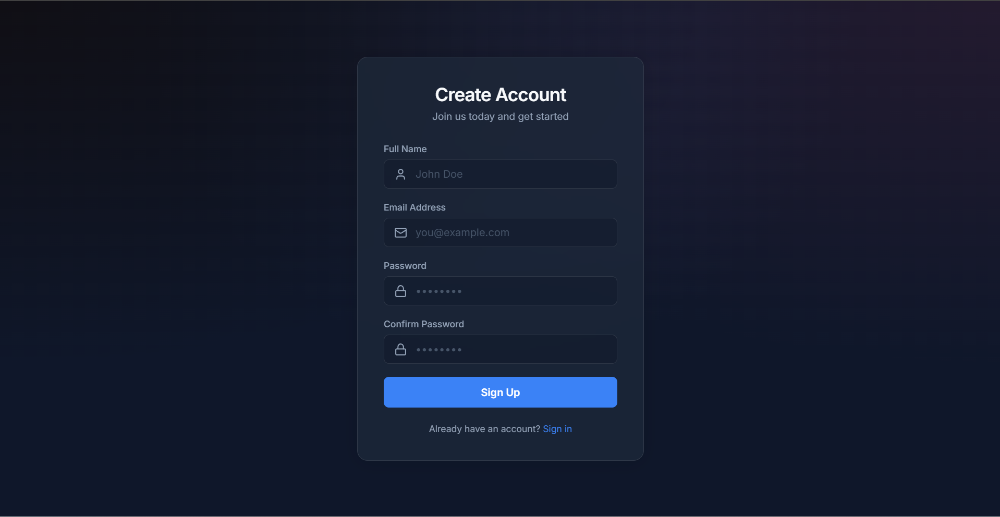
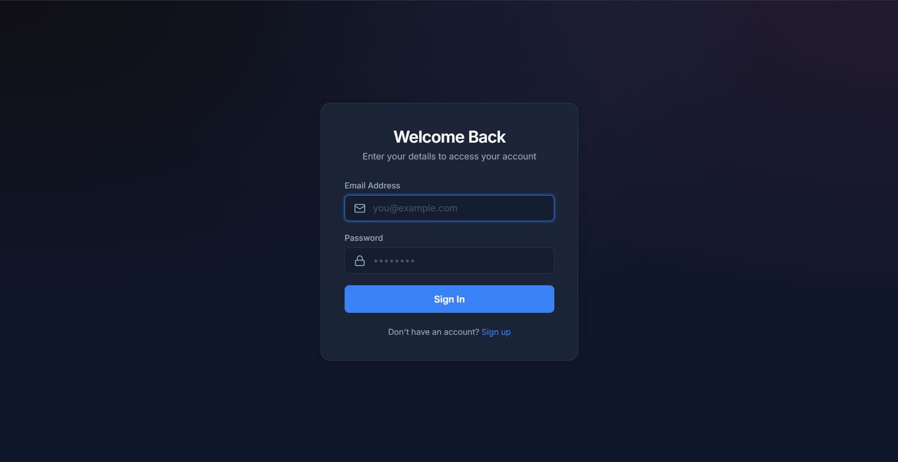
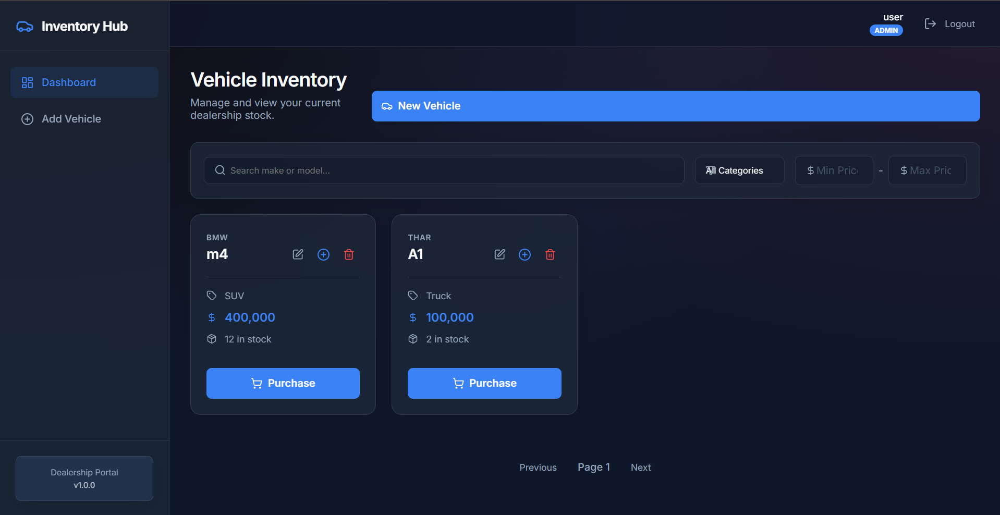
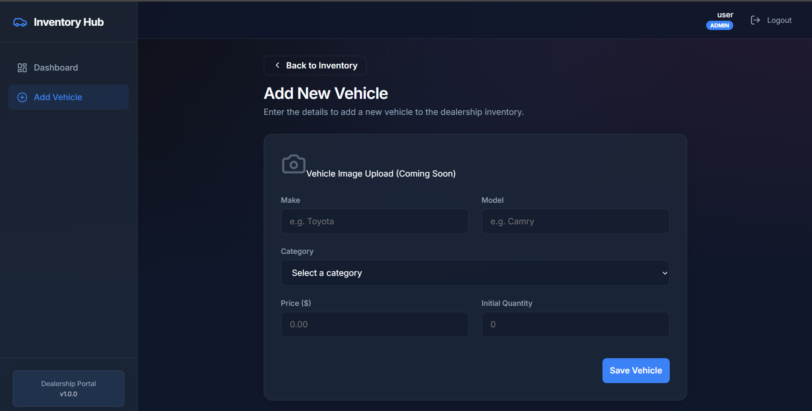
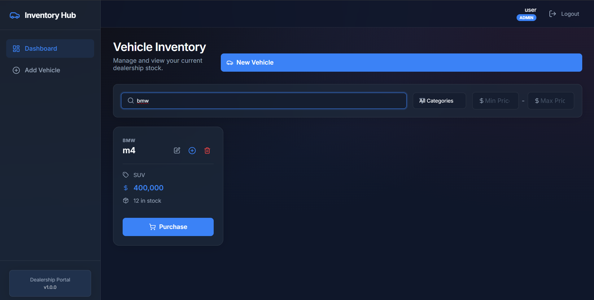
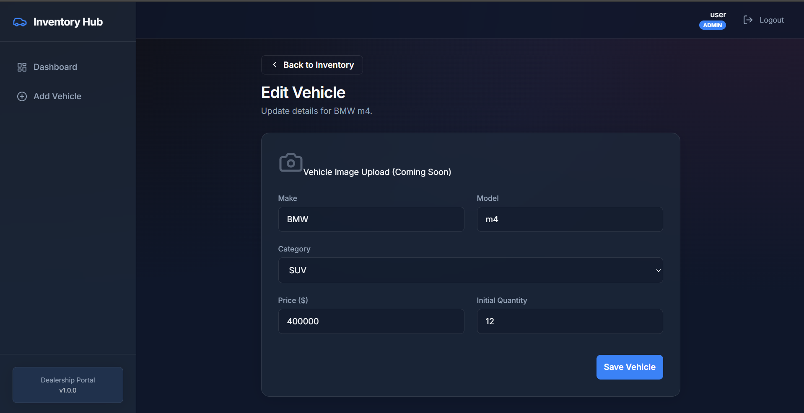
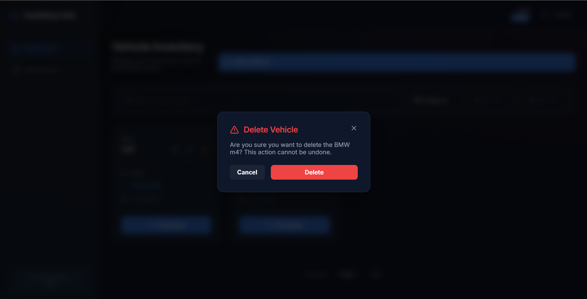
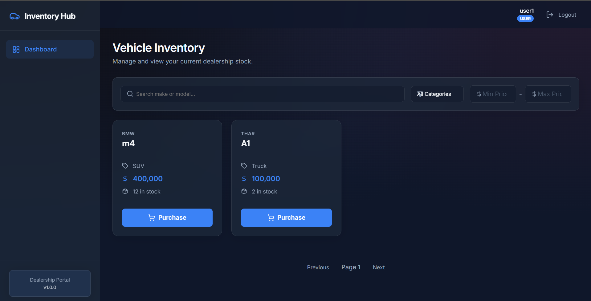

# Car Dealership Inventory System

## 📖 Project Overview
The **Car Dealership Inventory System** is a full-stack, enterprise-grade web application built to streamline the management of dealership vehicles. It provides a secure, intuitive interface for managing stock, processing purchases, and performing administrative operations (CRUD). Built with modern web technologies, the system emphasizes security (HTTP-only JWT sessions), clean architecture, and rigorous Test-Driven Development (TDD).

## ✨ Features
- **Secure Authentication:** True stateless session management using HTTP-only JSON Web Tokens (JWT).
- **Role-Based Access Control (RBAC):** Strict separation of concerns between standard Users (view/purchase) and Admins (add/edit/restock/delete).
- **Advanced Search & Filtering:** Dynamic, debounced frontend filtering backed by MongoDB `$or` regex queries to instantly search across Make, Model, Category, and Price Ranges.
- **Inventory Protection:** Atomic backend operations prevent negative inventory scenarios when users purchase vehicles.
- **Modern "Glassmorphism" UI:** A beautifully crafted, responsive dashboard with hover animations, dedicated sidebars, custom skeletons, and a unified layout system.
- **Comprehensive Test Coverage:** Built using Red-Green-Refactor TDD principles with 50+ passing backend and frontend tests.

## 🛠 Tech Stack
**Frontend:**
- React 18 (Vite)
- React Router DOM
- Axios (Interceptors for global error handling)
- CSS3 (Variables, Grid, Flexbox, Glassmorphism)
- Vitest & React Testing Library

**Backend:**
- Node.js & Express.js
- MongoDB & Mongoose
- JSON Web Tokens (JWT) & bcrypt
- express-validator
- Jest & Supertest

## 📂 Folder Structure
```text
D:\Car_Dealership_Inventory
├── backend/
│   ├── src/
│   │   ├── controllers/      # Request handlers
│   │   ├── middlewares/      # Auth, Error handling
│   │   ├── models/           # Mongoose schemas
│   │   ├── routes/           # Express routes
│   │   ├── services/         # Business logic & DB calls
│   │   ├── tests/            # Jest test suites
│   │   ├── utils/            # Helper classes
│   │   ├── validators/       # Request validation rules
│   │   ├── app.js            # Express app configuration
│   │   └── server.js         # Entry point
│   ├── makeAdmin.js          # Utility script to promote users
│   └── package.json
└── frontend/
    ├── src/
    │   ├── components/       # Reusable UI components
    │   ├── context/          # React Auth Context
    │   ├── hooks/            # Custom hooks (e.g. useDebounce)
    │   ├── pages/            # View components
    │   ├── services/         # API abstractions
    │   ├── tests/            # Vitest suites
    │   ├── App.jsx           # Main routing wrapper
    │   └── main.jsx          # React entry point
    ├── index.css             # Global design system
    ├── vite.config.js        # Vite & Proxy configuration
    └── package.json
```

## 🚀 Installation & Setup

### Prerequisites
- Node.js (v18+)
- MongoDB Atlas Account (or local MongoDB server)

### 1. Clone the Repository
```bash
git clone <repository_url>
cd Car_Dealership_Inventory
```

### 2. Environment Variables
Navigate to the `backend/` directory and create a `.env` file:
```env
PORT=5000
MONGO_URI=mongodb+srv://<username>:<password>@cluster.mongodb.net/?retryWrites=true&w=majority
JWT_SECRET=your_super_secret_jwt_key
JWT_EXPIRE=1h
JWT_COOKIE_EXPIRE=1
NODE_ENV=development
```

### 3. Install Dependencies
```bash
# Install backend dependencies
cd backend
npm install

# Install frontend dependencies
cd ../frontend
npm install
```

## 🏃 Running the Application

**Start the Backend (Terminal 1):**
```bash
cd backend
npm run dev
```

**Start the Frontend (Terminal 2):**
```bash
cd frontend
npm run dev
```
Navigate to `http://localhost:5173` in your browser.

## 🧪 Running Tests
The project features a rich test suite.

**Backend Tests (Jest + Supertest):**
```bash
cd backend
npm run test
```

**Frontend Tests (Vitest + React Testing Library):**
```bash
cd frontend
npm run test
```

## 📚 API Documentation
| Endpoint | Method | Access | Description |
|---|---|---|---|
| `/api/auth/register` | `POST` | Public | Register a new user |
| `/api/auth/login` | `POST` | Public | Login & receive HTTP-only cookie |
| `/api/auth/me` | `GET` | Private | Hydrate session data |
| `/api/auth/logout` | `POST` | Private | Destroy session cookie |
| `/api/vehicles` | `GET` | Private | Get all vehicles |
| `/api/vehicles/search` | `GET` | Private | Filter vehicles ($or make/model) |
| `/api/vehicles` | `POST` | Admin | Add a new vehicle |
| `/api/vehicles/:id` | `PUT` | Admin | Update vehicle details |
| `/api/vehicles/:id` | `DELETE`| Admin | Remove a vehicle |
| `/api/vehicles/:id/purchase` | `POST` | Private | Decrement vehicle stock |
| `/api/vehicles/:id/restock` | `POST` | Admin | Increment vehicle stock |

## 📸 Screenshots

















## 🌐 Deployment
- **Frontend**: Designed to be deployed on Vercel or Netlify.
- **Backend**: Designed to be deployed on Render, Heroku, or DigitalOcean.
Ensure you set the `.env` variables securely on your hosting provider and remove the Vite proxy config in production in favor of absolute API URIs.

---

## 🤖 My AI Usage

In compliance with the project's technical guidelines, I actively utilized AI tools to assist in the software development lifecycle. 

**Which AI tools I used:**
- **Antigravity AI (Google Deepmind Assistant)** 

**How I used them:**
- **Architecture & Scaffolding**: I used AI to quickly generate the Express backend boilerplate, configure the Vite React setup, and establish the initial folder structure.
- **Test-Driven Development (TDD)**: I relied heavily on AI to write the initial Red-phase unit tests using Jest and React Testing Library before I implemented the underlying green-phase logic.
- **Refactoring & Clean Code**: I used AI to audit my codebase. Specifically, the AI identified that my frontend was relying on `localStorage` for JWT tokens and guided me through migrating to a secure, HTTP-only cookie implementation via a `/me` endpoint.
- **UI/UX Design**: I prompted the AI to generate a cohesive "Modern Dealership" CSS framework utilizing CSS Grids and glassmorphism rather than writing standard utility classes from scratch.

## 🧠 Reflection
Integrating AI into my workflow drastically accelerated development time, especially when writing boilerplate and configuring testing libraries (which are often tedious). It acted as a fantastic "pair programmer" during the audit phase, catching a subtle Mongoose `pre-save` hook bug that I had overlooked and suggesting architectural improvements to adhere strictly to RESTful conventions. However, I learned that AI must still be carefully reviewed—I had to actively ensure the AI respected my specific requirements (like avoiding TailwindCSS in favor of Vanilla CSS) and verify that the security logic it proposed actually protected endpoints correctly. 

## 🔮 Future Improvements
- Add Stripe integration for actual payment processing upon vehicle purchase.
- Implement pagination on the frontend dashboard to handle thousands of vehicles seamlessly.
- Add image uploading capabilities (via AWS S3 or Cloudinary) so vehicles can display actual photography rather than placeholder icons.
